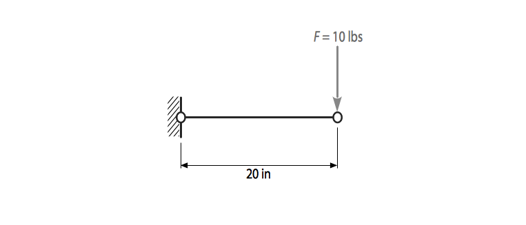

#   Beam Loading

A cantilever beam is loaded as shown in the figure. The Young’s Modulus is 29e6 psi and the Poisson’s ratio is 0.1. The goal is to do Finite Element Analysis of the problem and post process the results.  

1. Title: `Utility Menu→File→Change Title`

1. Enter title, Ok and then `Utility Menu→Plot→Replot`

1. Keypoint selection: `Main menu→Preprocessor→Modeling→Create→Keypoints→In Active CS`

1. Enter the coordinates $(0,0)$ and $(20,0)$. Press apply until done and then press ok.

1. Drawing lines: `Preprocessor→Modeling→Create→Lines→Lines→In Active Coord`. Pick the two keypoints and then press ok.

1. Defining elements: `Preprocessor→Element type→Add/Edit/Delete`. Choose Structural mass→Beam→2 node 188 and then ok.

1. Material properties: `Preprocessor→Material props→Material Models`.

1. `Structural→Linear→Elastic→Isotropic`. Enter `29e6` as `Ex` and `0.3` as `PRxy`. Then select ok and close material model window.

1. Beam section: `Main Menu→Preprocessor→Sections→Beam→Common Sections`. Choose the rectangular section and enter 2 for H and 4 for B as the dimensions.

1. Meshing: `Preprocessor→Meshing→MeshTool→Size Cntrls→Lines→Set`. Select the line and enter 20 in the NDIV field and then select ok.

1. `Preprocessor→Meshing→MeshTool→Mesh`. Select the line and then select ok. 

1. Saving: `Utility Menu→File→Save as`. Enter the file name and select the directory where you would like to save your file and then select ok.

1. Solution type: `Main Menu→Solution→Analysis Type→New Analysis`; `Static`

1. `Utility Menu→Plot→Keypoints→Keypoints` 

1. Constraints: `Main Menu→Solution→Define Loads→Apply→Structural→Displacement→On Keypoints`. Select Keypoint 1 and select ok in the selection box.

    1. Select All DOF, enter 0 in VALUE and then select ok.

1. Loading: `Solution→Define Loads→Apply→Structural→Force/Moment→On Keypoints`. Select Keypoint 2 and then select ok. 

    1. Select `FY` in `Direction of force/mom`, `Constant value`, `-10` in `VALUE`

1. Solving: `Preprocessor→Solution→Solve→Current LS`

1. Deflection: `General Postproc→Plot Results→Deformed Shape`; `Def + undef edge`

1. Deflection contour: `General Postproc→Plot results→Contour Plot→Nodal Solution→DOF Solution→Displacement vector sum`.

1. Stress contour: `General Postproc→Plot results→Contour Plot→Nodal Solution→Stress→von Mises stress`.

1. Element view: `Utility Menu→PlotCtrls→Style→Size and Shape`; `Display of element` `on`

1. Select `Dynamic model mode` and then rotate the geometry.  

1. Y - Deflection contour: `General Postproc→Plot results→Contour Plot→Nodal Solution→DOF Solution→Y-Component of displacement`.

1. Vector plot: `General Postproc→Plot results→Vector Plot→Predefined→DOF Solution→Translation U`