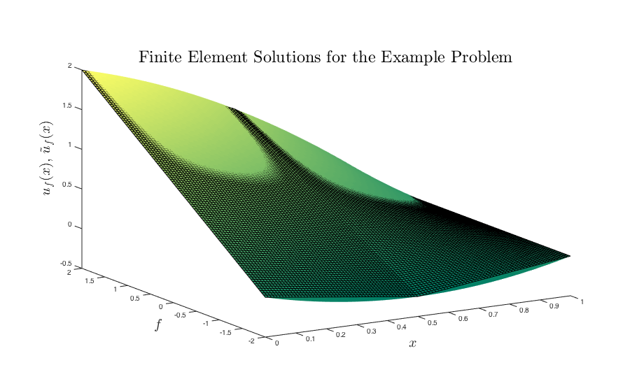
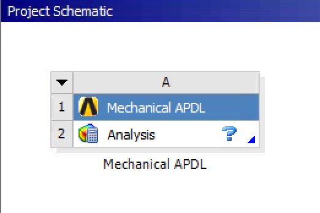
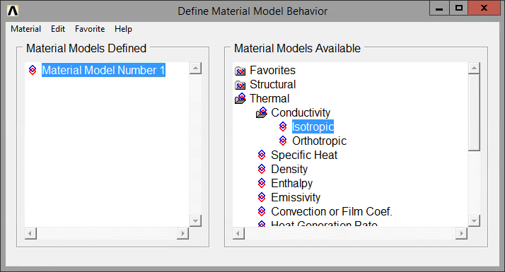
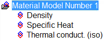
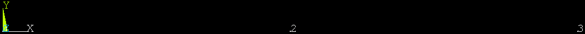
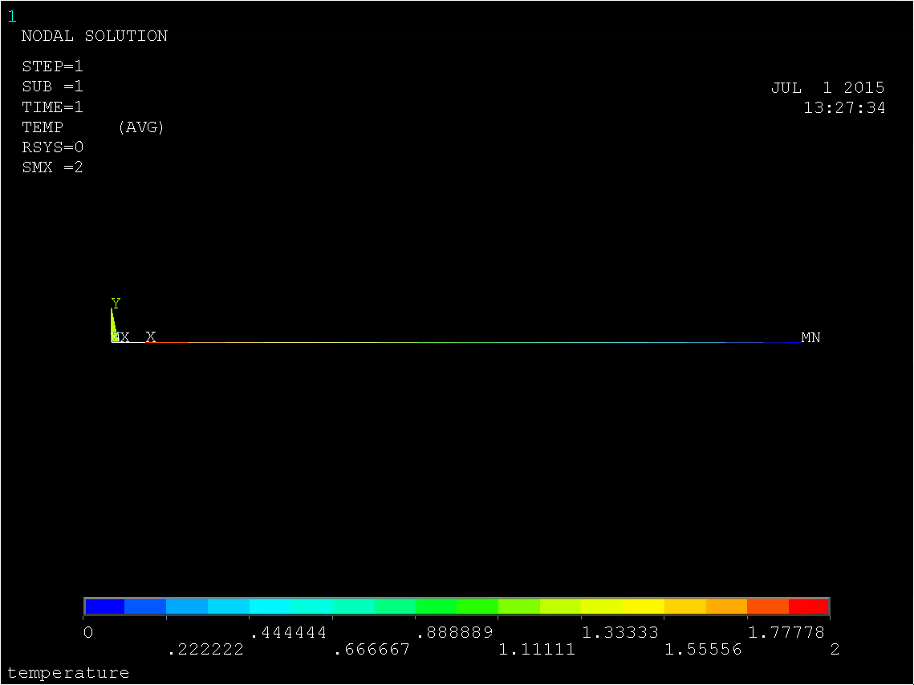

# Finite Element Modeling with ANSYS

### Course Overview

<blockquote>
︎❖ *Objective*:  Understand course expectations and policies.
</blockquote>

<blockquote>
"An FEA program allows an engineer to make mistakes at a rapid rate of speed. (R. Miller)"
</blockquote>

This is important, because a popular tenet of current design thought suggests that you should fail often and fail cheaply—in other words, bring your model in contact with reality as often as you can sustain in order to exploit the corrections that come from 

To a certain extent, I want you to treat everything I suggest in this class as a set of guidelines which can be explored and challenged.  Think of the computational environment as itself empirical—it is often easy for you to test small hypotheses and craft working problems which can be compared to each other and to reality.  Many questions in the course may thus be answered by the rejoinder—*do it!*

# A Brief Review of the Finite Element Method

<blockquote>
︎❖ *Objective*:  Understand the underlying computational process of the finite element method.
</blockquote>

### Solution Process

The basic algorithm for a finite element solution is as follows:

1.  Decompose the elements into structures and write a governing equation relationship (such as force-displacement) for each element.
1.  Assemble all of the elements to get the governing equation statement for the entire problem, $\underline{\underline{K}} \underline{c} = \underline{F}$.
1.  Apply the boundary conditions, $\underline{\underline{K}}^{*} \underline{c} = \underline{F}^{*}$.
1.  Solve the resulting linear system to get the solution $\underline{c}$.
1.  Post-process this result to extract stress, strain, displacement, and other variables of interest.

Mathematically, we proceed a bit differently, but it is easier to see where the foregoing steps arise if you have an understanding of the four basic forms of the problem:  strong $\mathbb{S}$, weak $\mathbb{W}$, Galerkin $\mathbb{G}$, and matrix $\mathbb{M}$.

#### $\mathbb{S}$ Strong Form

The strong form is the canonical mathematical statement of the boundary-value problem which you are accustomed to from your previous engineering studies.  The governing equations are stated for the domain, along with boundary conditions.

<blockquote>
Given $f$, $g$, $h$, find $u(x)$ such that
$$
\begin{align}
\frac{\text{d}^{2} u(x)}{\text{d} x^{2}} + f & = 0 & 01 \\
u(1) & = g \\
\left. \frac{\text{d} u}{\text{d} x} \right|_{x=0} & = -h \\
\end{align}
$$
</blockquote>

#### $\mathbb{W}$ Weak Form

The weak form is an equivalent variational statement of the problem.  A solution of $\mathbb{S}$ satisfies $\mathbb{W}$, and vice versa.

Integrate by parts to construct the weak form.  The weighting functions $w(x)$ are arbitrary as long as they satisfy the homogeneous form of the essential boundary conditions:  $w(x=1) = 0$.  Then the weak statement of the problem is:

<blockquote>
For any $w(x)$ such that $w(x=1)=0$, find $u(x)$ such that the following equation is satisfied:
$$
\begin{align}
\int_{0}^{1} \text{d}x\, \frac{\text{d}w}{\text{d}x} \frac{\text{d}u}{\text{d}x}
& = \left. w(x) \frac{\text{d}^{2} u(x)}{\text{d} x^{2}} \right|_{x=0}^{1} - \int_{0}^{1} \text{d}x\, \frac{\text{d}^{2} u(x)}{\text{d} x^{2}} w(x) \\
& = - w(x) f(x) \bigg|_{x=0}^{1} + \int_{0}^{1} \text{d}x\, f(x) w(x) \hspace{1cm}\text{by}\; \frac{\text{d}^{2} u(x)}{\text{d} x^{2}} + f = 0 \\
\int_{0}^{1} \text{d}x\, \frac{\text{d}w}{\text{d}x} \frac{\text{d}u}{\text{d}x}
& = \int_{0}^{1} \text{d}x\, w(x) f(x) + h w(0)
\end{align}
$$
</blockquote>

#### $\mathbb{G}$ Galerkin Form

Although the matrix form $\mathbb{M}$ is the actual statement of the problem which is solved by the machine, it is the Galerkin form $\mathbb{G}$ which dominates the numerics.  At this point, we assume a discretization (a mesh) and make approximations as to how we will represent the components of the solution.

Discretize the domain and approximate $u$ and $w$ by $\tilde{u}$ and $\tilde{w}$.

<blockquote>
For any $\tilde{w}(x)$ such that $\tilde{w}(x=1)=0$, find $\tilde{u}(x)$ such that the following equation is satisfied:
$$
\begin{align}
\int_{0}^{1} \text{d}x\, \frac{\text{d}w}{\text{d}x} \frac{\text{d}u}{\text{d}x}
& = \int_{0}^{1} \text{d}x\, w(x) f(x) + h w(0)
\Rightarrow \\
\int_{0}^{1} \text{d}x\, \frac{\text{d}\tilde{w}}{\text{d}x} \frac{\text{d}\tilde{u}}{\text{d}x}
& = \int_{0}^{1} \text{d}x\, \tilde{w}(x) f(x) + h \tilde{w}(0)
\end{align}
$$
</blockquote>

#### $\mathbb{M}$ Matrix Form

Although the Galerkin form is approximate, we have not yet specified the discretized approximating functions $\tilde{u}$ and $\tilde{w}$.  We will treat these as composed of shape functions $N_i$, which are equal to zero outside of the interval $x_{i-1} \leq x \leq x_{i+1}$.  The form of the shape functions can be varied, but we will here use a linear form:
$$
N_i(x) = \left\{
\begin{matrix}
\frac{x-x_{i-1}}{h_{i}}
\hspace{1cm} & x_{i-1} \leq x \leq x_{i} \\
\frac{x_{i+1}-x}{h_{i}}
\hspace{1cm} & x_{i} \leq x \leq x_{i+1} \\
0 & \text{elsewhere}
\end{matrix}
\right.
\text{.}
$$

The given approximating functions use these as a basis:
$$
\begin{align}
\tilde{u}(x)
& = \sum_{i=1}^{n+1} c_{i} N_{i}(x) \\
& = \sum_{i=1}^{n}   c_{i} N_{i}(x) + g N_{n+1}(x) \\ \\
\tilde{w}(x)
& = \sum_{i=1}^{n+1} d_{i} N_{i}(x) \\
& = \sum_{i=1}^{n}   d_{i} N_{i}(x)
\end{align}
$$
where $c_i$, $d_i$ are weighting coefficients.

With these definitions, we are equipped to rewrite the Galerkin form in an equivalent matrix form.  Substitute for $\tilde{u}$ and $\tilde{w}$ in $\mathbb{G}$:
$$
\begin{align}
\int_{0}^{1} \text{d}x\, \left[
\left( \sum_{i=1}^{n} d_{i} \frac{\text{d}N_{i}}{\text{d}x} \right)
\left( \sum_{j=1}^{n} c_{j} \frac{\text{d}N_{j}}{\text{d}x} + g \frac{\text{d}N_{n+1}}{\text{d}x} \right)
\right]
& =
\int_{0}^{1} \text{d}x\, \left[
\left( \sum_{i=1}^{n} d_{i} N_{i}(x) \right) f
\right]
+ \sum_{i=1}^{n} d_{i} N_{i}(0)
\end{align}
$$

Rewrite this equation as $\sum_{i=1}^{n} d_{i} G_{i}(x) = 0$, where
$$
G_i =
\sum_{j=1}^{n} \left[
\int_{0}^{1} \text{d}x\, c_{j} \frac{\text{d}N_{i}}{\text{d}x} \frac{\text{d}N_{j}}{\text{d}x}
\right]
+ g \left[
\int_{0}^{1} \text{d}x\, \frac{\text{d}N_{i}}{\text{d}x} \frac{\text{d}N_{n+1}}{\text{d}x}
\right]
- \int_{0}^{1} \text{d}x\, N_{i}(x) f
- h N_{i}(0)
\text{.}
$$

Define
$$
\begin{align}
K_{ij} & \equiv \int_{0}^{1} \text{d}x\, \frac{\text{d}N_{i}}{\text{d}x} \frac{\text{d}N_{j}}{\text{d}x}
& i,j \in \left\{1, ..., n\right\} \\
F_{i} & \equiv \int_{0}^{1} \text{d}x\, N_{i}(x) f + h N_{i}(0)
- g \left[
\int_{0}^{1} \text{d}x\, \frac{\text{d}N_{i}}{\text{d}x} \frac{\text{d}N_{n+1}}{\text{d}x}
\right]
& i \in \left\{1, ..., n\right\} \text{.} \\
\end{align}
$$

We can now write the matrix form of the problem, which will be solved using conventional linear-algebraic methods.

<blockquote>
Given the coefficient matrix $\underline{\underline{K}}$ and vector $\underline{F}$, find $\underline{c}$ such that
$$
\underline{\underline{K}} \underline{c} = \underline{F} \text{.}
$$
</blockquote>

### Solution Properties

A solution to either the strong form $\mathbb{S}$ or the weak form $\mathbb{W}$ will satisfy the other; similarly, solutions to either of the Galerkin form $\mathbb{G}$ or the matrix form $\mathbb{M}$ (defined over the same basis functions) will satisfy both.  The primary approximation is the transformation from the weak formulation $\mathbb{W}$ to the approximate Galerkin form $\mathbb{G}$.
$$
\mathbb{S} \leftrightarrow
\mathbb{W} \leftrightsquigarrow
\mathbb{G} \leftrightarrow
\mathbb{M}
$$

The stiffness matrix $\underline{\underline{K}}$ is symmetric, banded, and positive-definite, making it attractive for conventional matrix solution methods.

### Example Solutions

Consider the foregoing system with three nodes and two elements.  We wish to solve the system by hand for a few values of $f$, $g$, $h$.

#### Grid and Shape Functions

The shape functions are a function of the nodes (here, located equidistant at $x = \left\{0, \frac{1}{2}, 1\right\}$), and not of the equation.
$$
N_1(x) = \left\{
\begin{matrix}
\frac{x-0}{\frac{1}{2}}
\rightarrow &
1-2x
\hspace{1cm} & 0 \leq x \leq \frac{1}{2} \\
0 & & \frac{1}{2} \leq x \leq 1 \\
\end{matrix}
\right.
$$
$$
N_2(x) = \left\{
\begin{matrix}
\frac{\frac{1}{2}-x}{\frac{1}{2}}
\rightarrow &
2x
\hspace{1cm} & 0 \leq x \leq \frac{1}{2} \\
\frac{1-x}{\frac{1}{2}}
\rightarrow &
2-2x
\hspace{1cm} & \frac{1}{2} \leq x \leq 1
\end{matrix}
\right.
$$
$$
N_3(x) = \left\{
\begin{matrix}
0 & & 0 \leq x \leq \frac{1}{2} \\
\frac{x-1}{\frac{1}{2}}
\rightarrow &
2x-2
\hspace{1cm} & \frac{1}{2} \leq x \leq 1 \\
\end{matrix}
\right.
\text{.}
$$

#### Example 1:  $f = 0$, $g = 0$, $h = 1$, $n = 2$
The problem statement reduces to
<blockquote>
Find $u(x)$ such that
$$
\begin{align}
\frac{\text{d}^{2} u(x)}{\text{d} x^{2}} & = 0 & 0<x<1 \\
u(1) & = 0 \\
\left. \frac{\text{d} u}{\text{d} x} \right|_{x=0} & = -1 \\
\end{align}
$$
</blockquote>

To find the resulting matrix formulation $\mathbb{M}$:

The matrix elements of $\underline{\underline{K}}$ are
$$
\begin{align}
K_{11} & = \int_{0}^{1} \text{d}x\, \frac{\text{d}N_{1}}{\text{d}x} \frac{\text{d}N_{1}}{\text{d}x}
= \int_{0}^{\frac{1}{2}} (-2)(-2) = 4x\bigg|_{x=0}^{\frac{1}{2}}
& = 2 \\
K_{12} & = K_{21} = \int_{0}^{1} \text{d}x\, \frac{\text{d}N_{1}}{\text{d}x} \frac{\text{d}N_{2}}{\text{d}x}
= \int_{0}^{\frac{1}{2}} (2)(-2) = -4x\bigg|_{x=0}^{\frac{1}{2}}
& = -2 \\
K_{22} & = \int_{0}^{1} \text{d}x\, \frac{\text{d}N_{2}}{\text{d}x} \frac{\text{d}N_{2}}{\text{d}x}
= \int_{0}^{\frac{1}{2}} (2)(2) + \int_{\frac{1}{2}}^{1} (-2)(-2) = -4x\bigg|_{x=0}^{\frac{1}{2}} + 4x\bigg|_{x=\frac{1}{2}}^{1}
& = 4 \\
\end{align}
$$
thus $\underline{\underline{K}} = \left[ \begin{matrix} 2 & -2 \\ -2 & 4 \end{matrix} \right]$.

The solution vector $\underline{F}$ is
$$
\begin{align}
F_{1} & = \frac{1}{2} N_1(0) = \frac{1}{2} \\
F_{2} & = \frac{1}{2} N_2(0) = 0 \\
\end{align}
$$
and $\underline{F} = \left[ \begin{matrix} 1 \\ 0 \end{matrix} \right]$.

The unknown vector $\underline{c}$ is now found as
$$
\begin{align}
\underline{\underline{K}} \underline{c} & = \underline{F} \Rightarrow \\
\left[ \begin{matrix} 2 & -2 \\ -2 & 4 \end{matrix} \right] \underline{c}
& = \left[ \begin{matrix} 1 \\ 0 \end{matrix} \right] \Rightarrow \\
\underline{c} & = {\left[ \begin{matrix} 2 & -2 \\ -2 & 4 \end{matrix} \right]}^{-1} \times \left[ \begin{matrix} 1 \\ 0 \end{matrix} \right] \\
\underline{c} & = \left[ \begin{matrix} 1 \\ \frac{1}{2} \end{matrix} \right] \text{.}
\end{align}
$$

Substituting the coefficients back into the approximating solution $\tilde{u}$ now yields the FEM solution:
$$
\tilde{u}(x) = \sum_{i=1}^{n} c_{i} N_{i}(x) + g N_{n+1}(x)
= 1 \left\{ \begin{matrix} 1-2x \\ 0 \end{matrix} \right. + \frac{1}{2} \left\{ \begin{matrix} 2x & 0 \leq x \leq \frac{1}{2} \\ 2-2x & \frac{1}{2} \leq x \leq 1 \end{matrix} \right.
= \left\{ \begin{matrix} 1-2x+x \\ 1-x \end{matrix} \right.
= 1-x
$$

The exact solution is $u = 1 - x$, in this case corresponding exactly to the FEM solution.

#### Example 2:  $f \in \mathbb{R}$, $g = 0$, $h = 1$, $n = 2$
For arbitrary real $f$, the problem statement becomes
<blockquote>
Find $u(x)$ such that
$$
\begin{align}
\frac{\text{d}^{2} u(x)}{\text{d} x^{2}} + f & = 0 & 0<x<1 \\
u(1) & = 0 \\
\left. \frac{\text{d} u}{\text{d} x} \right|_{x=0} & = -1 \\
\end{align}
$$
</blockquote>

The nodes have not changed, so the shape functions remain the same.  As before, we find the components of the matrix solution.

The matrix elements of the stiffness matrix $\underline{\underline{K}}$ remain the same, as they are not a function of the source term $f$.

The solution vector $\underline{F}$ becomes
$$
\begin{align}
F_{1} & = \int_{0}^{1} \text{d}x\, N_{1}(x) f + 1 \cdot N_1(0) \\
& = \int_{0}^{\frac{1}{2}} \text{d}x\, (1-2x) f + 1 = 1+\frac{1}{4}f \\
F_{2} & = \int_{0}^{1} \text{d}x\, N_{2}(x) f + 1 \cdot N_2(0) \\
& = \int_{0}^{\frac{1}{2}} \text{d}x\, (2x) f + \int_{\frac{1}{2}}^{1} \text{d}x\, (2-2x) f
= \frac{1}{2} f \\
\end{align}
$$
and $\underline{F} = \left[ \begin{matrix} 1+\frac{1}{4} f \\ \frac{1}{2} f \end{matrix} \right]$.

The unknown vector $\underline{c}$ is now found as
$$
\begin{align}
\underline{\underline{K}} \underline{c} & = \underline{F} \Rightarrow \\
\left[ \begin{matrix} 2 & -2 \\ -2 & 4 \end{matrix} \right] \underline{c}
& = \left[ \begin{matrix} 1+\frac{1}{4} f \\ \frac{1}{2} f \end{matrix} \right] \Rightarrow \\
\underline{c} & = {\left[ \begin{matrix} 2 & -2 \\ -2 & 4 \end{matrix} \right]}^{-1} \times \left[ \begin{matrix} 1+\frac{1}{4} f \\ \frac{1}{2} f \end{matrix} \right] \\
& = {\left[ \begin{matrix} 1 & \frac{1}{2} \\ \frac{1}{2} & \frac{1}{2} \end{matrix} \right]} \times \left[ \begin{matrix} 1+\frac{1}{4} f \\ \frac{1}{2} f \end{matrix} \right] \\
\underline{c} & = \left[ \begin{matrix} 1+\frac{1}{2} f \\ \frac{1}{2}+\frac{3}{8} f \end{matrix} \right] \text{.}
\end{align}
$$

Substituting the coefficients back into the approximating solution $\tilde{u}$ now yields the general FEM solution for the case of $f \in \mathbb{R}$, $g = 0$, $h = 1$, $n = 2$:
$$
\tilde{u}(x) = \sum_{i=1}^{n} c_{i} N_{i}(x) + g N_{n+1}(x)
= \left(1+\frac{1}{2} f\right) \left\{ \begin{matrix} 1-2x \\ 0 \end{matrix} \right. + \left(\frac{1}{2}+\frac{3}{8} f\right) \left\{ \begin{matrix} 2x \\ 2-2x \end{matrix} \right.
= \left\{ \begin{matrix} \left(1+\frac{1}{2}f\right)+\left(-1-\frac{1}{4}f\right)x & 0 \leq x \leq \frac{1}{2} \\ \left(1+\frac{3}{4}f\right)+\left(-1-\frac{3}{4}f\right)x & \frac{1}{2} \leq x \leq 1  \end{matrix} \right. \text{.}
$$

The exact solution is quadratic:
$$
u(x) = -\frac{f}{2}x^{2}-x+\left(1+\frac{f}{2}\right) \text{.}
$$
The FEM solution approximates this solution along the element intervals and matches the exact solution at the nodes.  Some specific cases are plotted in the figure below.  (The black grid represents the approximate solution $\tilde{u}(x)$, and the smooth colored surface represents the real solution $u(x)$.)

---
# Computer-Enabled FEA

<blockquote>
︎❖ *Objective*:  Reproduce finite element method hand calculations in a computational FEM tool and articulate their relation.
</blockquote>

Let us now program and solve the foregoing example explicitly using ANSYS Mechanical APDL and compare the results.  We first need to determine what physics is represented by our purely mathematical consideration above.  Recall the strong form of the problem statement $\mathbb{S}$ for our prior set of solution conditions:
<blockquote>
Find $u(x)$ such that
$$
\begin{align}
\frac{\text{d}^{2} u(x)}{\text{d} x^{2}} + 2 & = 0 & 0<x<1 \\
u(x=1) & = 0 \\
\left. \frac{\text{d} u}{\text{d} x} \right|_{x=0} & = -1 \\
\end{align}
$$
</blockquote>

This second-order differential equation is much like the heat equation

$$-\alpha\frac{\text{d}^{2} u(x)}{\text{d} x^{2}} + F = 0$$

with thermal diffusivity $\alpha \equiv \frac{k}{C_{\text{P}}\rho}$ and a source term $F$, subject to the same boundary conditions (transformed for unit conversions).

-   Start ANSYS Workbench and drag the `Mechanical APDL` module from the *Toolbox→Component Systems* pane to the *Project Schematic* area.  Right-click on `Analysis` and select `Open Mechanical APDL...`.
    

-   Set the jobname and title to `thermal`.  These options are found on the *Toolbar* under `File`.

#### Preprocessor:  Element Type

-   At the *Main Menu* (the left-hand panel), select `Preprocessor→Element Type→Add/Edit/Delete`.  In the resulting *Element Types* dialog box, press the `Add...` button and select `Thermal Mass→3D Conduction 33` from the *Library of Element Types*.  This adds the [`LINK33`](http://www.ansys.stuba.sk/html/elem_55/chapter4/ES4-33.htm) element type to the simulation, 

The `LINK33` element requires a cross-sectional area for the calculation.

-   Select `Preprocessor→Real Constants→Add/Edit/Delete`, which opens the *Real Constants* dialog box.  As there are currently no real constants defined, the list reads simply `NONE`.  Press `Add...` and select `LINK33`.  ANSYS now requests a cross-sectional `AREA` from you; enter `0.01`  for $0.01 \,\text{m}^{2}$.

<blockquote>
☞*Aside*:  Recall that ANSYS has no conception of units, and simply relies upon you to ensure that all of your values are couched in consistent terms.
</blockquote>

#### Preprocessor:  Material Properties

The `LINK33` element requires material properties as well as the real property of `AREA` just defined.  We need to define the values contributing to our definition $F \equiv -f/\alpha = \frac{-f C_{\text{P}}\rho}{k}$; thus we require $C_{\text{P}}$, $\rho$, $k$, and $f$.

-   Select `Preprocessor→Material Props→Material Models` to access the *Define Material Model Behavior* dialog.
    
    
    
    -   $C_{\text{P}}$:  Under *Material Models Available*, highlight the option `Thermal→Specific Heat`.  ANSYS requests a value `C`; enter `434` for $434 \,\text{J}\cdot\text{kg}^{-1}\cdot\text{K}^{-1}$.
    -   $\rho$:  Under *Material Models Available*, highlight the option `Thermal→Density`.  ANSYS requests a value `DENS`; enter `7854` for $7854 \,\text{kg}\cdot\text{m}^{-3}$.
    -   $k$:  Under *Material Models Available*, highlight the option `Thermal→Conductivity→Isotropic`.  ANSYS requests a value `KXX`; enter `60.5` for $60.5 \,\text{W}\cdot\text{m}^{-1}\cdot\text{K}^{-1}$.
    -   Your *Material Models Defined* should now look like this:
        
        
        
    -   Close the *Define Material Model Behavior* dialog.  To double-check our input, on the *Toolbar* select `List→Properties→All Materials`.  The *MPLIST Command* dialog appears and we can check the results of our inputs in the preceding steps.
    
-   Select `Temperature Units` and set these to `Celsius`.

<blockquote>
☞*Aside*:  The [Elements Reference Index](http://www.ansys.stuba.sk/html/e-index.htm) is a good resource if you are trying to figure out how to use any of these cryptic options like `DENS` and `QRATE`.
</blockquote>

#### Preprocessor:  Modeling

We now need to define our model.  Since we are trying to reproduce similar conditions to the hand-solved model above, we require only two nodes.  These will be defined using *keypoints* as reference anchors.

-   In the *Main Menu*, select `Preprocessor→Modeling→Create→Keypoints→In Active CS`.  In the resulting *Create Keypoints in Active Coordinate System* dialog, input `0` for both `X` and `Y`; leave the other text boxes blank.

    
    
    Select `Apply`, then repeat the process for $(0.5,0)$ and $(1,0)$.  Press `Cancel` to finally close the dialog (pressing `OK` will create two coincident keypoints at the final location).  ANSYS now shows the resulting keypoints in the main plot area.
    
    

We aren't finished yet; now we need to define the connecting lines over which our mesh will be laid.

-   In the *Main Menu*, select `Preprocessor→Modeling→Create→Lines→Lines→In Active Coord`.  The *Lines in Active Coord* dialog appears and asks you to `Pick` any two keypoints.  Select points 1 and 2; a line appears and turns blue as it is instanced into the model.  Repeat this between points 2 and 3, which generates a violet line.
    
    

#### Preprocessor:  Meshing

The mesh is overlaid on the geometry model, but we need to specify how many elements should be created per line.

-   In the *Main Menu*, select `Preprocessor→Meshing→Size Cntrls→ManualSize→Lines→All Lines`.  The *Element Sizes on All Selected Lines* dialog appears; input `1` for `NDIV`, the number of divisions that should be applied to each line.

-   In the *Main Menu*, select `Preprocessor→Meshing→Mesh→Lines`.  In the *Mesh Lines* dialog simply select `Pick All`.  The model is meshed.

#### Preprocessor:  Loads

Since there is no dependence on temperature in our set of material properties, our choice of reference values becomes somewhat arbitrary.  We will leave the right-hand value as 0, while the left-hand derivative statement must be translated into conduction terms.  While we wrote

$$\left. \frac{\text{d} u}{\text{d} x} \right|_{x=0} = -1$$

before, we now need a boundary condition of the form

$$\left. -k \frac{\text{d} u}{\text{d} x} \right|_{x=0} = q_\text{s}'' \text{.}$$

This implies that $\frac{q_\text{s}''}{k} = 1$ and thus $q_\text{s}'' = k = 60.5$.  (We can get away with playing fast and loose with units precisely because we are rigorously staying in the same SI unit system.)

$$q_\text{s}'' = 60.5 \,\text{W}\cdot\text{m}^{-2}$$

(Note that with an insulating boundary condition this conversion is unnecessary, as 0 on the right-hand side allows one to cancel all units.  Also note that this is the first place that using $u$ in both statements is really starting to confuse us, since we really do mean different things.  Alas.)

-   In the *Main Menu*, select `Preprocessor→Loads→Define Loads→Apply→Thermal→Temperatures→On Keypoints`.  In the *Apply TEMP on KPs* dialog, pick keypoint 3 at the far right-hand side.  In the *Apply TEMP on Keypoints* dialog that results, select the `TEMP` degree of freedom and specify a `VALUE` of `0`.

-   In the *Main Menu*, select `Preprocessor→Loads→Define Loads→Apply→Thermal→Heat Flow→On Keypoints`.  In the *Apply HEAT on KPs* dialog, pick keypoint 1 at the far left-hand side.  In the *Apply HEAT on KPs* dialog that results, select the `HEAT` degree of freedom and specify a `VALUE` of `60.5`.

We now reconsider that the starting differential equation.  We have defined $f \equiv -F/\alpha = 2$; this requires $F = -2 \alpha = \frac{-2 k}{C_{\text{P}}\rho} = 3.54 \times 10^{-5} \,\text{K}\cdot\text{s}^{-1}$.

<blockquote>
☞*Aside*:  These units may make you uncomfortable.  Where does this time dimension come from, for instance‽  Note that we are solving the steady-state or time-independent version; thus the left-hand side of the differential equation faces only zero across the equals sign, and we can arbitrarily add or remove the proportionality unit for time $\text{s}$.
</blockquote>

-   In the *Main Menu*, select `Preprocessor→Loads→Define Loads→Apply→Thermal→Heat Generat→Uniform Heat Gen`.  ANSYS requests a value `HGEN`; enter `-35.4e-6` for $-3.54\times10^{-5} \,\text{s}\cdot\text{m}^{-2}$.

#### Solution

-   In the *Main Menu*, select `Solution→Solve→Current LS`.  Review the *\STATUS Command* dialog and then tell ANSYS to solve the system.  After a few seconds you are notified that the calculation is complete.

#### Postprocessor

-   In the *Main Menu*, select `General Postproc→Plot Results→Contour Plot→Nodal Solu`.  Select `Nodal Solution→DOF Solution→Nodal Temperature` and `Apply` to view the temperature heatmap.

-   In the *Main Menu*, select `General Postproc→List Results→Nodal Solution`.  A table of calculated temperatures by node coordinates appears.

The values we obtain here are wildly unrealistic.  Something has clearly gone wrong.  But what?

#### Reconsideration

This stumped me for a while, but I figured out a reasonable hypothesis.  Modern ANSYS actually doesn't do well with trivial examples:  the way it calculates the flux vector normal to the outlet, for instance (here in the line of the model), requires more nodal values than are here available.  But we can backdoor the problem, since we in fact already know what the value *should* be at the left-hand node from the exact solution obtained earlier.  There is nothing dishonorable in this, since our goal is to solve a problem, not to solve it under an arbitrary set of limits.

-   Delete the old loads by going to `Preprocessor→Loads→Define Loads→Delete→All Load Data→All Loads & Opts`.

-   Create new boundary conditions in temperature of 2 at the left-hand side and 0 at the right-hand side.  Set the heat generation term as well, to the same value as before.

-   Solve the system again and check the results.
    
    

#### Log

Note that there has been a running commentary and output on your activities in the *Mechanical APDL 15.0 Output Window*, a shell window open behind the main window.  This contains information resulting from calculations you carry out as well as (some) executed commands.