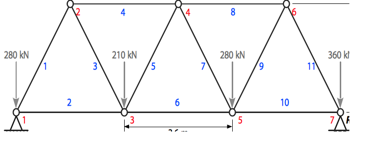

#   Truss Loading

A truss is shown in the figure. The cross sectional areas of the links are 3250 mm1. The Young’s modulus is 200 GPa and the Poisson’s ratio is 1.1. The Key points are shown in red and the links are shown in blue. The applied loads are also shown in the figure. The goal is to do Finite Element Analysis of the structure and post process the results.

1. Title: `Utility Menu→File→Change Title`

1. Enter title, Ok and then Utility Menu→Plot→Replot
The following keypoints are to be entered next:

| Keypoint | $x$   | $y$  | $z$ |
|----------|-------|------|-----|
| 1        | 0     | 0    | 0   |
| 2        | 1800  | 3118 | 0   |
| 3        | 3600  | 0    | 0   |
| 4        | 5400  | 3118 | 0   |
| 5        | 7200  | 0    | 0   |
| 6        | 9000  | 3118 | 0   |
| 7        | 10800 | 0    |     |

1. Keyword selection: `Main menu→Preprocessor→Modeling→Create→Keypoints→In Active CS`

1. Enter the coordinates and press apply until done

1. Drawing lines: `Preprocessor→Modeling→Create→Lines→Lines→In Active Coord`

1. Start picking keypoints and press ok once done.

1. Defining elements: `Preprocessor→Element type→Add/Edit/Delete`

1. Choose `Structural mass→Link→3D finit stn 180` and then ok

1. Real constants: `Preprocessor→Real Constants→Add/Edit/Delete` and then click Add

    1. Enter `3250` as `area` and press Ok. After that close the real constant box.

1. Material properties: `Preprocessor→Material props→Material Models`

1. `Structural→Linear→Elastic→Isotropic`. Enter `200000` as `Ex` and `1.3` as `PRxy`. Then select ok and close material model window.

1. Meshing: `Preprocessor→Meshing→Size Cntrls→ManualSize→Lines→All Lines`. Enter `1` in the `NDIV` field and then select ok.

1. `Preprocessor→Meshing→Mesh→Lines`
 
1. Select `Pick All`

1. Keypoint numbering: `Utility Menu→PlotCtrls→Numbering`. Select as shown in the figure and select ok.

1. Saving: `Utility Menu→File→Save as`. Enter the file name and select the directory where you would like to save your file and then select ok.

1. Solution type: `Main Menu→Solution→Analysis Type→New Analysis`. Select as shown and then ok.

1. `Utility Menu→Plot→Keypoints→Keypoints`. 

1. Constraints: `Main Menu→Solution→Define Loads→Apply→Structural→Displacement→On Keypoints`. Select `Keypoint 1` and select ok in the selection box.
    1. Select `All DOF`, enter `0` in `VALUE` and then select ok.
    
    1. Similarly apply the constraint on the right end by deselecting `All DOF`, selecting `UY` and finally entering `1`.

1. Loading: `Solution→Define Loads→Apply→Structural→Force/Moment→On Keypoints`. Select Keypoint 1 and then select ok. 

    1. Select `FY` in `Direction of force/mom`, `Constant value` in `Apply as` and enter `-280000` in `VALUE`. Then select ok.
    
    1. Apply the remaining loads similarly. At the end the structure will show the loads.

1. Solving: `Main Menu→Solution→Solve→Current LS`. Then select ok. Once solution is done close the box.

1. Reaction forces: `General Postproc→List Results→Reaction Solu`. Select `All struc forc F` and then select ok. The window will give the reaction force results.

1. Deflection : `General Postproc→Plot Results→Deformed Shape`. Select `Def + undef edge` and then ok.

    1. The screen should show the deflection plot.

1.  Deflection contour: `General Postproc→Plot results→Contour Plot→Nodal Solu`. Then select as shown in the figure and select ok.

1. The screen should show the displacement contour plot.

1. Listing deflection: `General Postproc→List Results→Nodal Solution`. Then select DOF solution and Displacement vector sum as before. Then select ok.

    1. The results are shown in terms of nodes. The node and Keypoint numbering may not be the same. The node numbering can be obtained by selecting Plot from the Utility menu. 
	