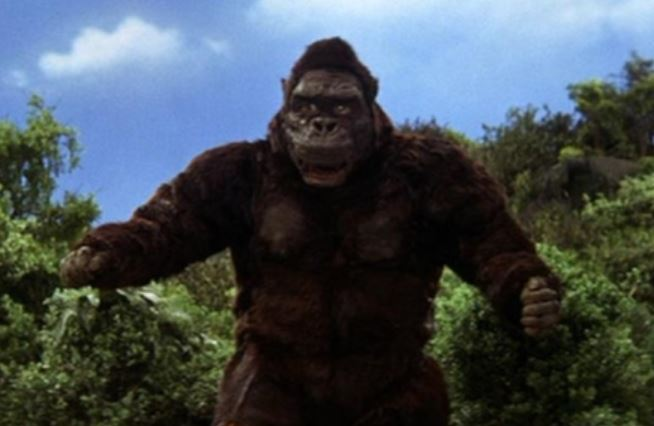
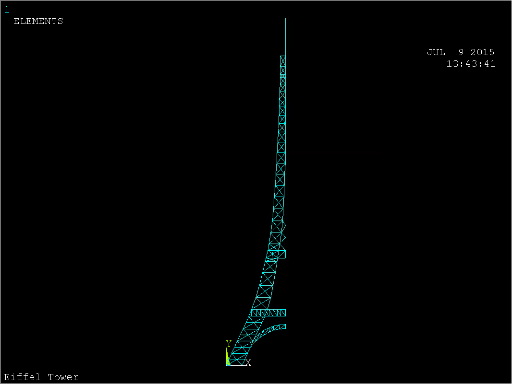

#   King Kong

In this project, we will model the effect of King Kong climbing to the top of the Eiffel Tower via displacement and stress calculations.  (Now, it is true but irrelevant that King Kong never *did* climb the Eiffel Tower, but it's just an accident of history that this never happened.)

The Eiffel tower is a wrought-iron structure weighing 7,300 tonnes[Wikipedia](https://en.wikipedia.org/wiki/Eiffel_Tower#Design).  Its characteristic exponential shape derives from Gustave Eiffel's primary concern:  resisting the wind effectively.  In fact, the tower does so so well that it only sways up to 7 cm in the breeze.  (If we have time, we can calculate this effect as well.)

We will make a few simplifying assumptions—for instance, we will model the Eiffel tower in two dimensions, which allows us to take advantage of an axial symmetry as well.

##  Preprocessing

### Element

As the Eiffel tower is constructed like an iron truss, we will use [`BEAM188`](http://www.ansys.stuba.sk/html/elem_55/chapter4/ES4-188.htm) elements.  These are three-dimensional beams that we will use with restricted degrees of freedom.  These will have a square cross-sectional area of $0.9 \,\text{m} \times 0.9 \,\text{m} = 0.81 \,\text{m}^{2}$ (defined in `Section`).

### Geometry

The Eiffel tower has a complex connectivity, to say the least.  To type in the keypoints used to define the elements would be prohibitively difficult, so instead I have provided a file, `eiffel-keypoints.txt`, which can be used in conjunction with the `\PREP7` command to input them *en masse*.

Once these have been input, please carefully define the lines according to this image.  (This connectivity is not completely true to the real Eiffel tower because in 2D we end up with insufficient degrees of freedom if we don't add a few additional links in.)

### Mesh

The mesh should have a sizing of 1.  Then go ahead and mesh all lines.

### Loading

We require three conditions:  a symmetry condition along the right-hand side of the tower; fixed supports at the base of the tower; and King Kong himself, straddling the top of the tower.

Set the rightmost nodes to translate only along the $y$-axis, and fix all degrees of freedom for the base nodes.

As Mr. Kong's vital statistics are astonishingly hard to come by (he even tends to change relative size from scene to scene much less movie to movie), we are going to assume a standard value of $2,040.8 \,\text{kg} \times 9.8 \,\text{m}\cdot\text{s}^{-2} = 20,000 \,\text{N}$.  We will split this weight in two (as he stands with two feet abreast the Eiffel Tower, majestic and tragic) and assign $10,000 \,\text{N}$ of force to a keypoint on each side.

##  Solution

First, make sure that you are carrying out a `static` analysis.  Then `solve` the model.

If all goes well, you should receive notice that the solution has completed.  If you get a "small pivot" error, then you haven't specified all of the lines involved in the geometry above or perhaps all of the loads; check closely, then re-mesh and proceed normally.

##  Postprocessing

Look at the displacement and the stress/strain values.  Extract the underlying data as a table of numerical values.