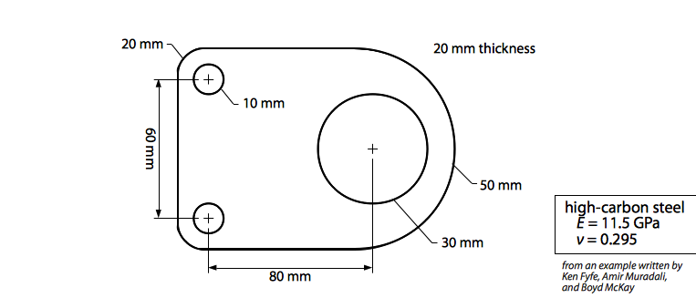

#   Bracket (Solid Modeling)

We have a bracket built from $20 \,\text{mm}$ thick high-carbon steel plate.  We wish to model the deformation resulting from forces applied in its intended application.  (The original inspiration for this exercise comes from [Fyfe1999](#Fyfe1999).)

This geometry is the most complex that we've yet seen:  the base shape is composed of several rectangles and circles, and has bolt holes removed as well.  In order to accomplish this within Mechanical APDL, we will have to use *Boolean operations*, which allow us to combine or subtract geometric components from a solid model.

##  Preprocessing

First we need to create the shape itself.  We will carry out this process in two stages:  first an aggregation of the full shape, then a removal of the bolt holes.  Create the following shapes.  (Save often, because undoing things is hard in ANSYS!)

-   `Preprocessor→Modeling→Create→Areas→Rectangle→By 2 Corners`:  $(0,0), (80,100)$

-   `Preprocessor→Modeling→Create→Areas→Circle→Solid Circle`:  $(80,50) r 50$

-   `Preprocessor→Modeling→Create→Areas→Circle→Solid Circle`:  $(0,20) r 20$

-   `Preprocessor→Modeling→Create→Areas→Circle→Solid Circle`:  $(0,80) r 20$

-   `Preprocessor→Modeling→Create→Areas→Rectangle→By 2 Corners`:  $(-20,20), (0,80)$

We will now use Boolean operations to merge these areas into one large area.

-   `Preprocessor→Operate→Booleans→Add→Areas`:  select all five areas and `OK`

Now remove the bolt holes.

-   `Preprocessor→Modeling→Create→Areas→Circle→Solid Circle`:  $(80,50) r 30$

-   `Preprocessor→Modeling→Create→Areas→Circle→Solid Circle`:  $(0,20) r 10$

-   `Preprocessor→Modeling→Create→Areas→Circle→Solid Circle`:  $(0,80) r 10$

-   `Preprocessor→Operate→Booleans→Subtract→Areas`

Now set the element type.

-   `Preprocessor→Element Type→Add/Edit/Delete`:  `solid→quad82`
    
    -   `quad82` requires `Options...` to be used properly:  set `Element Behavior K3` to `Plane strs w/thk` and `Extra Element Output K5` to `nodal stress`.
    
    -   `quad82` requires `Real Constants` as well.  Set a `thickness` of `20`.
    
-   `Preprocessor→Material Props→Constant→Isotropic...` and set:
    
    -   `Young's modulus` to `11500` (MPa to accord with mm)(
    -   `Density` to `7.854e-06`
    -   `Poisson's ratio (minor)` to `0.295`
    -   `Shear modulus` to `80000`
    -   `Emissivity` to `1` (can skip this one really)

Now mesh.

-   `Preprocessor→Meshing→Shape & Size→Global Elem Size...`
    -   `Size` `5`
-   `Preprocessor→Meshing→Mesh→Areas`

We will now apply constraints.

-   `Preprocessor→Loads→Apply→Structural→Displacement`
    
    -   To do this properly, we need to plot the nodes and use the `PlotCtrls` menu `Pan/Zoom/Rotate` option to see the appropriate zones in more detail.
    
    -   Select the inner nodes on the upper small bolt hole and fix `All DOF` to `0.0`.
    
    -   Repeat this process with the lower bolt hole.

The load will now be applied to the large bolt hole.

-   `Preprocessor→Loads→Apply→Force/Moment→On Nodes`
    
    -   At the bottom of the large bolt hole, apply `FY` of `-1000`.

-   Plot the elements again.

Now solve the model.

##  Postprocessing

-   `General PostProc→Read Results→Last Set`

-   `Plot Results→Deformed Shape...`

-   `Contour Plot→Nodal Solu...`; `Stress→von Mises SEQV`; explore others as well

Refine the mesh if there is enough time.

##  References

-   <a id="Fyfe1999">Fyfe1999</a>:  K. Fyfe, A. Muradali, B. McKay.  [2D plane stress bracket tutorial](https://web.archive.org/web/20090310171327/http://homepages.strath.ac.uk/~clas16/~fyfe/ansys/bracket/bracket.html).

